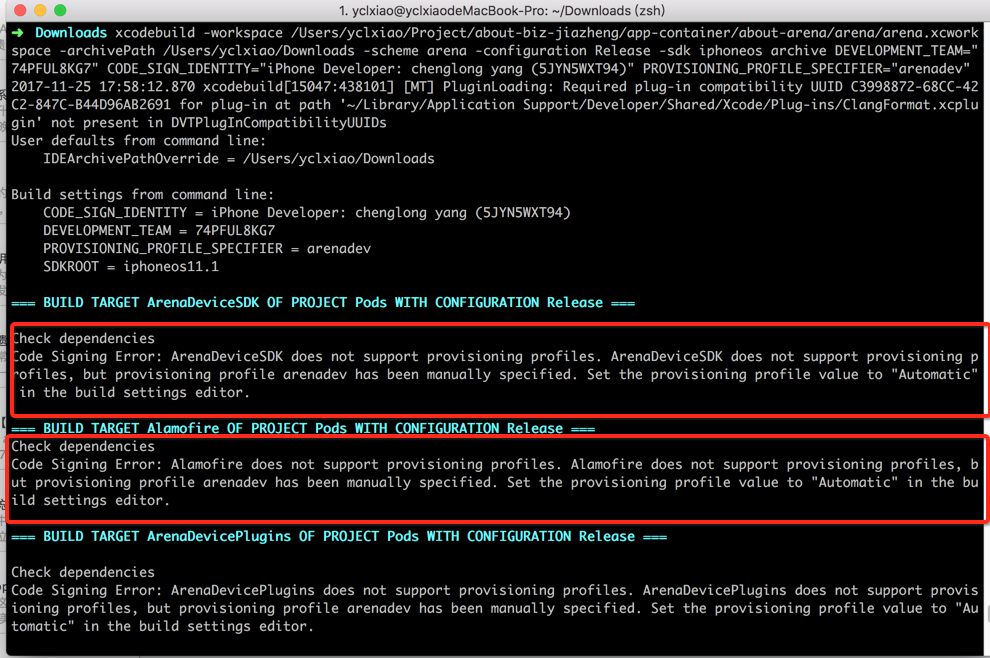

# xcodebuild9
xcodebuild9自动打包踩坑记

## 1. 说说与xcodebuild8的主要区别
> 1. 第一步archive是不需要指定开发证书、描述文件等。
> 2. 第二步的时候需要在plist文件中添加开发证书、描述信息等

## 2. 打包脚本以及说明
```
1、xcodebuild clean -workspace ${TARGET_NAME}.xcworkspace -scheme ${TARGET_NAME} -configuration ${BUILD_TYPE}
2、xcodebuild archive -workspace ${TARGET_NAME}.xcworkspace -scheme ${TARGET_NAME} -configuration ${BUILD_TYPE} -archivePath {ARCHIVEPATH}
3、xcodebuild -exportArchive -archivePath "${ARCHIVEPATH}/${TARGET_NAME}.xcarchive" -exportPath ${EXPORTPATH} -exportOptionsPlist ${EXPORTOPTIONSPLIST}

1. ${TARGET_NAME} 项目对应targets的名字
2. ${BUILD_TYPE} 打包类型 Debug，Release 等
3. ${archivePath} .xcarchive文件导出目录
4. ${EXPORTPATH} 导出.ipa包的目录
5. ${EXPORTOPTIONSPLIST} exportOptionsPlist文件所在目录，可判断development, ad-hoc等
```

## 3. 自己本地打包的示例
```
—手动的方式，注意：手动的方式不需要指定证书、签名等信息
xcodebuild archive -workspace /Users/yclxiao/Project/about-biz-jiazheng/app-container/about-arena/arena/arena.xcworkspace -scheme arena -configuration Release -archivePath /Users/yclxiao/Downloads/arena

--自动的方式
xcodebuild -workspace /Users/yclxiao/Project/about-biz-jiazheng/app-container/about-arena/arena/arena.xcworkspace -archivePath /Users/yclxiao/Downloads/arena.xcarchive -scheme arena -configuration Release -sdk iphoneos archive DEVELOPMENT_TEAM="74PFUL8KG7"

--archive打包成ipa
xcodebuild -exportArchive -archivePath /Users/yclxiao/Downloads/arena.xcarchive -exportPath /Users/yclxiao/Downloads/arena.ipa -exportOptionsPlist /Users/yclxiao/Downloads/info.plist
```

> info.plist文件示例，需要现在文本文件里写好保存，不能直接用vi编辑器，否则会有格式错误

```plist
<?xml version="1.0" encoding="UTF-8"?>
<!DOCTYPE plist PUBLIC "-//Apple//DTD PLIST 1.0//EN" "http://www.apple.com/DTDs/PropertyList-1.0.dtd">;
<plist version="1.0">
<dict>
    <key>teamID</key>
    <string>74PFUL8KG7</string>
    <key>provisioningProfiles</key>
    <dict>
        <key>com.bm001.mobile.arena</key>
        <string>arenadev</string>//描述文件名称
    </dict>
    <key>method</key>
    <string>development</string>//development/app-store/企业分发等
    <key>compileBitcode</key>
    <false/>
    <key>uploadSymbols</key>
    <false/>
</dict>
</plist>
```

## 4. 遇到坑的文档记载
```
xcode9打包的坑
http://www.cocoachina.com/ios/20171016/20803.html
http://www.jianshu.com/p/6b68cd9307bc
http://lejia.li/?p=30
http://blog.csdn.net/yuanmengong886/article/details/78214978
https://www.5288z.com/2106.html
```

## 5. 之前猜测的原因
> 还没找到确切的证据，我猜测的原因：
> 
1. 在第一步archive时并没有让你指定某一个描述文件或者开发证书之类的
2. 真正指定开发证书和描述文件的是在第二步，把archive变成ipa时，需要配置plist文件，在plist文件中指定描述证书、appid、证书等信息
3. 根据archive生成ipa包时，如果采用的是开发环境证书打包的ipa只有20多兆，如果是证书的证书居然有100多兆？
	* 这个不算是问题，因为打开发环境包的时候，里面选的机型才几个，但是打包正式包的时候，是要适配所有机型。上架appstore时，appstore会自动处理这个大小，每个机型看到appstore里的大小实际没这么大
	
	
## 6. 自己本地的证书信息
